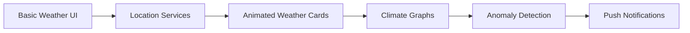

<div align="center">


<br/>


<br/><br/>

**Explore Earth. Understand Climate. Stay Ahead.**

TerraScope is a **Flutter-powered mobile app** that lets users explore and monitor Earth’s climate and environmental data through a **clean, intuitive, and modern UI**. It delivers **real-time, location-aware insights** with smooth interactions and scalable architecture.

</div>

---

## ✨ Highlights

* 🚀 Fast, smooth Flutter UI
* 📍 Smart location-based environmental data
* ☁️ Real-time API-driven weather insights
* 🎨 Minimal, modern design language
* 🧩 Built to scale with advanced features

---

## 🖼️ Live Preview & Animations

<div align="center">


</div>

> 🎞️ Smooth transitions, animated weather cards, live location loading, and gesture-based navigation

---

## 🚀 Features (Animated UX)

✨ Designed with motion-first UI principles

### ✅ Current

* 🏠 **Home Dashboard**
  Displays essential weather & climate information at a glance

* 📍 **Location-Based Data**
  Automatically fetches environmental stats for the user’s current location

* ☁️ **Live API Integration**
  Real-time data such as:

  * Temperature
  * Humidity
  * Weather conditions
  * Air quality (API dependent)

* 🎨 **Minimal UI/UX**
  Clean layouts, smooth animations, and responsive design

---

### 🔮 Planned Features

* 📊 Interactive climate graphs & historical trends
* 🌙 Dark mode support
* ⭐ Favorite & saved locations
* 📴 Offline mode for cached locations
* 🔔 Climate anomaly alerts & notifications
* 🗺️ Advanced maps & radar layers

---

## 🧠 Tech Stack

| Layer            | Technology                                |
| ---------------- | ----------------------------------------- |
| Framework        | Flutter                                   |
| Language         | Dart                                      |
| APIs             | OpenWeatherMap / WeatherAPI / Custom APIs |
| IDE              | VS Code                                   |


---

## ⚙️ Installation & Setup

### 1️⃣ Clone the Repository

```bash
git clone https://github.com/ajilaries/TerraScope-APP.git
cd TerraScope-APP
```

### 2️⃣ Install Dependencies

```bash
flutter pub get
```

### 3️⃣ Configure API Keys

Create a `.env` file (or update constants) and add your API keys:

```env
WEATHER_API_KEY=your_api_key_here
```

> ⚠️ Never commit API keys to public repositories

### 4️⃣ Run the App

```bash
flutter run
```

---

## 🏗️ Project Structure (Simplified)

```text
lib/
 ├── screens/
 ├── services/
 ├── widgets/
 ├── models/
 └── main.dart
```

---

## 🤝 Contributing

Contributions are welcome 🚀

1. Fork the repo
2. Create a new branch (`feature/your-feature`)
3. Commit your changes
4. Push to the branch
5. Open a Pull Request

---

## 🛣️ Roadmap

<div align="center">



</div>

* [ ] Dark Mode
* [

## 📜 License

This project is licensed under the **MIT License** — feel free to use, modify, and distribute.

---

## 💙 Author

**Ajil**
Student • Flutter Developer • Climate-Tech Enthusiast

If you like this project, don’t forget to ⭐ the repository!
